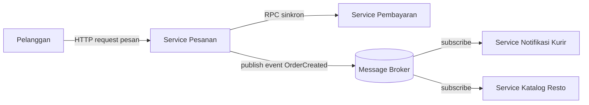

# Tugas 2 (Pekan 2) — Perancangan Arsitektur untuk FoodGo

**Materi terkait:** Architectural style (Layered, SOA, Peer-to-Peer, Publish-Subscribe).

## Studi Kasus

Melanjutkan Tugas 1: FoodGo butuh sistem yang **decoupled** agar tim kurir dan tim resto tidak saling mengganggu ketika salah satu modul diperbarui/deploy ulang. Saat ini semua modul (pesanan, pembayaran, notifikasi kurir, katalog resto) berjalan sebagai satu aplikasi monolitik — sekali deploy, semua modul ikut restart dan berisiko downtime total.

## Tugas Kelompok

1. Pilih **satu** gaya arsitektur utama: **Service-Oriented Architecture (SOA)** atau **Publish-Subscribe**. Boleh dikombinasikan (mis. SOA untuk service inti + Pub-Sub untuk notifikasi), tapi harus dijustifikasi kenapa kombinasi ini yang dipilih.
2. Gambarkan minimal 4 komponen berikut dan interaksinya: modul Pesanan, modul Pembayaran, modul Kurir/Notifikasi, modul Katalog Resto (dan message broker/API gateway jika relevan).
3. Jelaskan alur satu skenario penuh secara end-to-end di diagram (misalnya: pelanggan buat pesanan → bayar → resto terima notifikasi → kurir ditugaskan) — tunjukkan komponen mana berkomunikasi dengan siapa, dan **jenis komunikasinya** (sinkron/asinkron, request-response/event).
4. Analisis tertulis: kenapa gaya ini mengatasi masalah *coupling* dari Tugas 1, dan apa trade-off-nya (mis. Pub-Sub menambah kompleksitas debugging karena alur tidak linear).

## Cara Membuat Diagram (Gratis, Cukup Laptop)

Tidak perlu software berbayar. Dua opsi:

**Opsi A — Mermaid di dalam Markdown (disarankan).** Ditulis sebagai teks biasa di `README.md`, otomatis dirender jadi diagram oleh GitHub — tidak perlu install apa pun.

````markdown

````

**Opsi B — draw.io / diagrams.net** (gratis, jalan di browser tanpa akun, atau app desktop offline di [app.diagrams.net](https://app.diagrams.net/)). Ekspor sebagai `.png` dan simpan di folder `diagram/`.

## Struktur Submission

```
tugas-02-perancangan-arsitektur/
├── README.md          # Analisis + diagram Mermaid (jika Opsi A) atau referensi ke diagram/
├── JURNAL.md
└── diagram/            # File .png/.drawio jika pakai Opsi B
```

## Rubrik Penilaian (Tugas 2)

| Komponen | Bobot | Kriteria |
|---|---|---|
| Ketepatan pemilihan gaya arsitektur | 20% | Justifikasi SOA/Pub-Sub sesuai kebutuhan *decoupling* di skenario |
| Kelengkapan & kejelasan diagram | 30% | Semua komponen kunci ada, jenis komunikasi (sinkron/asinkron) jelas ditandai |
| Analisis trade-off | 30% | Bukan hanya kelebihan — kekurangan/kompleksitas baru juga dibahas |
| Proses & kontribusi kelompok | 20% | `JURNAL.md`, commit history |

## Batasan Penggunaan AI (Level 2)

Kebijakan **Level 2 (AI Assisted Idea Generation & Structuring)** berlaku — lihat [`../RUBRIK-UMUM.md`](../RUBRIK-UMUM.md). Boleh memakai AI untuk brainstorming komponen apa saja yang umum ada di gaya arsitektur SOA/Pub-Sub; **tidak boleh** meminta AI menggambar diagram final atau menuliskan analisis trade-off yang tinggal ditempel. Catat pemakaian AI di "Log Penggunaan AI" pada `JURNAL.md`.

- Diagram Mermaid/draw.io yang "terlalu generik" (identik dengan contoh tutorial di internet tanpa penyesuaian ke kasus FoodGo) akan dinilai rendah pada komponen kelengkapan & kejelasan diagram.


## JAWABAN KAMI

### DIAGRAM

 
### PENJELASAN & ALUR DIAGRAM

1. Customer --> API Gateway
Penjelasan : **customer** melakukan pemesanan dengan cara mengirimkan request melalui **API Gateway**, yang berfungsi sebagai pintu masuk untuk menerima dan meneruskan request dari customer ke service yang sesuai. 

2. API Gateway --> Modul Pesanan
penjelasan : setelah request ditampung **API Gateway** request diteruskan menuju **Modul Pesanan** sebagai "buat Pesanan(sinkron)" yang dimana **Modul Pesanan** bertindak sebagai koordinator seluruh proses pesanan

3. Modul Pesanan --> Modul Katalog
penjelasan : **Modul Pesanan** mengirimkan permintaan "Cek Katalog/Stoknya (Sinkron/Request)" ke **Modul Katalog** untuk cek dan minta konfirmasi apakah stok tersedia atau tidak, Modul Katalog mengakses Database FoodGo ("Akses Database") untuk mengambil data menu/stok terkini, setelah itu modul Katalog mengembalikan "(Respon/Sinkron) List Menu/Stok" kembali ke **Modul Pesanan**. 

4. Modul Pesanan --> Modul Pembayaran
penjelasan : setelah melakukan cek stok pada database foodgo dan stok ternyata ada, Pesanan minta diproses pembayaran (sinkron, request-response). Modul Pembayaran melakukan akses ke database untuk mencatat transaksi dan mengembalikan "Hasil Pembayaran"(sinkron) ke Modul Pesanan. mengapa demikian? karena pesanan perlu tahu status bayar sebelum melanjutkan ke proses selanjutnya.

5. Modul Pesanan --> Modul Restoran
penjelasan : setelah pembayaran sukses, pesanan mengirim "Confirmed Order" ditandai dengan garis putus - putus pada diagram yang artinya adalah mpodul pesanan tidak menunggu restoran merespons secara langsung

6.  Modul restoran --> Modul Kurir/notifikasi kurir
penjelasan :"Notifikasi Penugasan Untuk Kurir" ditandai dengan garis putus putus karena seperti modul pesanan. yang dimana Restoran tidak menunggu kurir menerima tugas

Modul Restoran
penjelasan :Modul Restoran berfungsi untuk menyimpan/mengonfirmasi order di sisi resto dan meneruskan notifikasi ke kurir

Modul Kurir
penjelasan : Modul kurir melakukan pencatatan penugasan dan status pengiriman untuk notifikasi

### ANALISIS TERTULIS (Alasan Arsitektur Ini Dapat Menangani Coupling)

Arsitektur SOA yang kami pilih ini dapat mengurangi coupling yang terjadi pada FoodGo karena arsitektur sebelumnya yang monolith/monolitik, SOA mengurangi coupling dengan memsiahkan setiap modul menjadi sebuah service terpisah yang punya peran masing-masing. Dengan memilih arsitektur SOA tentu akan ada trade-off yaitu bertambahnya kompleksitas sistem. Kompleksitas ini terdapat pada bagian komunikasi yang sebelumnya dilakukan dalam 1 sistem menjadi beberapa service terpisah melalui jaringan, sehingga perlu menangani kemungkinan network failure, timeout, keterlambatan response, dan kegagalan service. Selain itu, proses debugging menjadi lebih sulit karena satu alur pemesanan dapat melibatkan beberapa service, seperti pemesanan -> Katalog -> Pembayaran -> Restoran -> Kurir.

Oleh karena itu, SOA dapat mengurangi coupling yang terjadi pada FoodGo sebelumnya, tetapi sebagai gantinya sistem memiliki lebih banyak komunikasi dan mekanisme terhubung yang harus dikelola dengan baik.