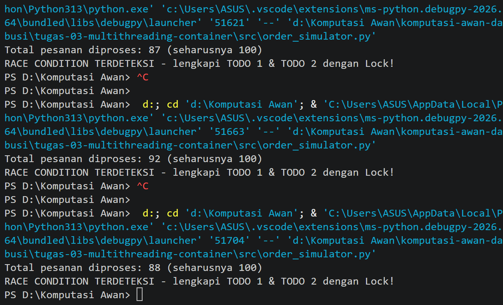
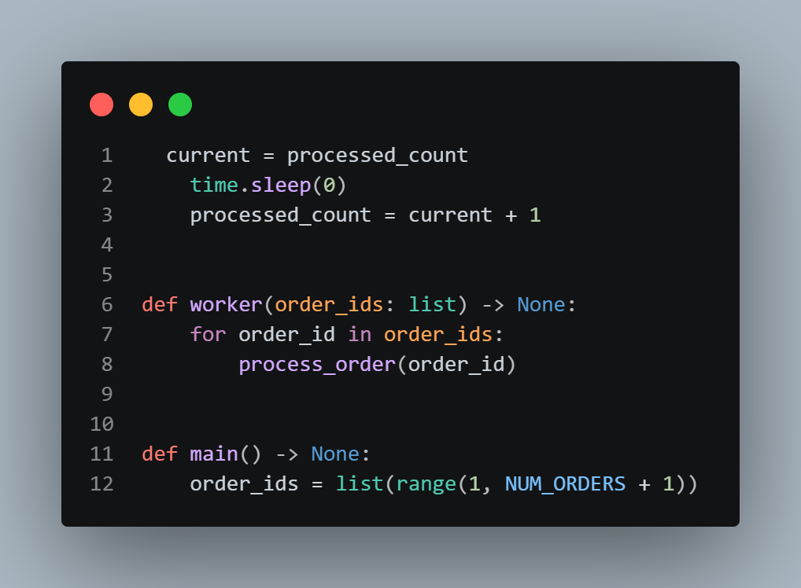
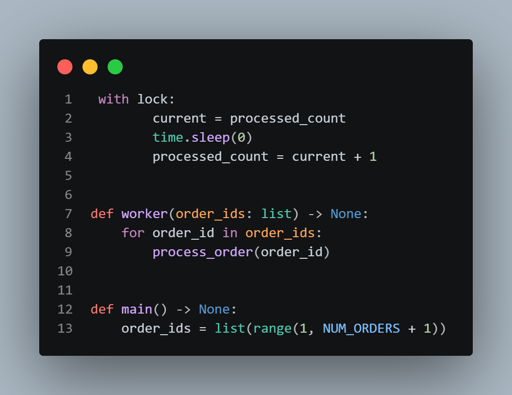

# Jurnal Proses — Tugas 3

## Percobaan tanpa Lock
- Hasil `processed_count` yang didapat: 

# Codenya

- Kenapa bisa meleset (jelaskan mekanisme race condition dengan kata sendiri): Hal ini dapat terjadi karena "processed_count" dipakai bersama oleh 10 thread.Yang dimana increment sebenarnya terdiri dari tiga langkah (baca nilai, tambah 1, tulis kembali), karena tidak adanya proteksi dengan memberikan lock, dua thread bisa membaca nilai lama yang sama lalu keduanya menulis hasil yang sama dan satu pesanan hilang, nah karena itu increment dibungkus pakai "with lock" agar hanya satu thread yang dapat menjalankan langkah baca, tambah, dan tulis dalam satu waktu sehingga hasilnya konsisten tepat 100

## Percobaan dengan Lock
- Hasil `processed_count` setelah perbaikan: 

## Kendala Docker
- saat `docker build`/`docker run` dijalankan tidak ada kendala sama sekali

## Diskusi [2 Oktober 2026]
- Peserta: Ro'yul dan Luthfi 
- Poin diskusi: Membagi tugas (Tugas 1(Luthfi): mengerajakan order_simulator.py, Screenshot bukti dan jelaskan mekanise race condition di jurnal.md) (tugas 2(Ro'yul): Mengerjakan bagian Dockerfile, jalankan docker build & run, Screenshot bukti build,run dan image, buat analisis kasus foodgo di readme.md)

## Review Silang
- [Ro'yul] Mereview kode [Luthfi]: Apakah kode di main memang double untuk variable size dan thread

## Log Penggunaan AI (Level 2)

> Wajib diisi sesuai kebijakan Level 2 di [`../RUBRIK-UMUM.md`](../RUBRIK-UMUM.md). Tulis "Tidak memakai AI" pada baris pertama jika memang tidak dipakai. Hanya untuk brainstorming ide/outline — bukan untuk kode/analisis/teks akhir.

| Tanggal | Tool AI | Prompt yang diberikan | Ringkasan saran/ide AI | Bagaimana diolah jadi tulisan/kode sendiri |
|---|---|---|---|---|
|03-10-2026|chatgpt |ini untuk todo 2 maksudnya itu aku disuruh run dulu sebelum diubah sama setelah di tambahkan increment lock kah apa kek mana? | ringkasan/saran/ide AI adalah pendapatku hampir benar tapi ai menambahkan "bukan berarti kamu menjalankan kode kosong namun tidak perlu memanggil fungsi "with_lock" yang sudah kamu buat" | jadi saya langsung masukin current = processed_count, time.sleep(0), processed_count = current + 1, tidak menggunakan "with_lock" agar jalan tanpa lock |
|03-10-2026|Gemini|Di docker Hub bagian python ada banyak sekali versinya seperti slim, rc-slim, alpine, bookworm dan lain-lain, coba beritahu aku apa arti dari nama-nama versi python itu dan sebutkan ukuran mereka|AI memberi tahu arti dari setiap jenis pyhton dan ukurannya, contohnya python-alpine adalah python ukuran kecil (50mb)namun sering eror, bookworm/trixie itu nama kode rilis debian, slim itu ukurannya kurang lebih 150-200mb dan lain-lain| Saya jadi tahu apa maksud dari versi python dan ukuran mereka, jadi karena instruksi dockerfile pakai py-slim saya fokus di py-slim saja dan memilih 3.11-slim|

## Bukti Diskusi

